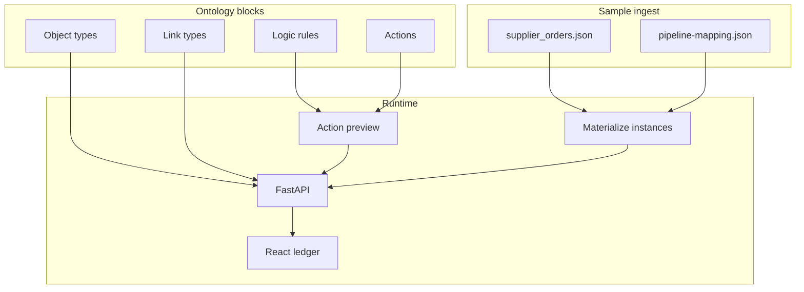

# Architecture

The public slice is a **typed world model**, not a chat wrapper.

## Why this shape

A planning agent has to name a supplier, walk `HAS_SUPPLIER`, and know whether `ApprovePurchaseOrder` is legal. Those facts live in the ontology. Prompt text can explain them; it must not invent them.

| Layer | What the agent gets |
| --- | --- |
| Object type | A stable id and property list (`PurchaseOrder.amount`) |
| Link type | A typed edge, not a free-text relation |
| Logic rule | A gate the preview endpoint evaluates |
| Action | A write the agent may propose, often with a human in the loop |

## What this repo is not

- Not a GitLab mirror of an internal hub
- Not a Neo4j / MinIO / private-registry stack
- Not live plant or customer master data

The compose file starts **backend + frontend** on public images only. Optional graph databases stay out of the public slice.

## Interview line

*I work on the ontology layer our agents use — object types, relations, logic rules and actions — so the agent has a typed world model instead of only prompt text.*
