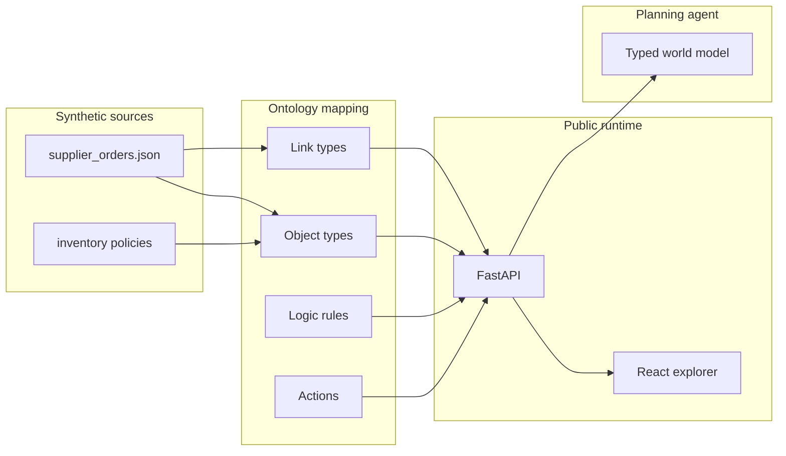

# Agent Ontology Hub

The **ontology layer an agent uses as its world model**: object types, relations, logic rules, and executable actions. First public sample domain: **supply chain planning** (suppliers, purchase orders, inventory policies).

This is a **sanitized public slice**, not a mirror of any internal GitLab. Internal hostnames, private registries, production compose files, and real customer masters are stripped.

Inspired by Palantir-style ontology platforms and the open-source [nano-ontoprompt](https://github.com/jingw2/nano-ontoprompt) architecture (Pipeline Mapping + LLM extraction).

| Building block | Role for an agent |
| --- | --- |
| **Entity (object type)** | Typed things the agent can name (`Supplier`, `PurchaseOrder`) |
| **Relation (link type)** | Typed edges (`PurchaseOrder -HAS_SUPPLIER-> Supplier`) |
| **Logic rule** | Constraints and state machines the agent must respect |
| **Action** | Allowed operations (`ApprovePurchaseOrder`, `FlagLateShipment`) |

## Architecture



The agent does not invent suppliers or approval thresholds from prompt text. It reads typed objects, walks typed links, and asks the action preview whether a write is allowed.

## What is in this snapshot

- English positioning README and architecture diagram
- FastAPI runtime that materializes the sample graph from JSON
- `GET /api/objects/{type}/{id}` — typed instance + incident links (agent read, not a dump of the whole graph)
- `GET /api/objects/{type}/{id}/walk/{linkType}` — follow one named edge (for example `HAS_SUPPLIER`)
- React explorer (title-block ledger + action preview)
- Public-image `docker-compose.v2.yml` (backend + frontend only)
- `.env.example` (placeholders only)
- Synthetic supply-chain sample and ontology mapping under `samples/supply-chain/`

## Quick start

```bash
# API
cd backend
python -m pip install -r requirements.txt
python -m pytest
python -m uvicorn app.main:app --reload --port 8000

# Explorer (second terminal)
cd frontend
npm install
npm run dev
```

Open http://localhost:5173

Or:

```bash
cp .env.example .env
docker compose -f docker-compose.v2.yml up --build
```

Try `ApprovePurchaseOrder` on `PO-2024-0001` (amount rule) and `FlagLateShipment` on `PO-2024-0003` (late receipt).

Agent read (no chat, no prompt stuffing):

```bash
curl http://localhost:8000/api/objects/PurchaseOrder/PO-2024-0001
curl http://localhost:8000/api/objects/PurchaseOrder/PO-2024-0001/walk/HAS_SUPPLIER
```

## Secret scan

```bash
python scripts/scan-secrets.py
```

The scan fails on private-registry hosts, internal compose filenames, and secret-shaped assignments. See `SANITIZE.md`.

GitHub About / topics: paste from `GITHUB-ABOUT.md`. Longer architecture notes: `ARCHITECTURE.md`.

## License

MIT
